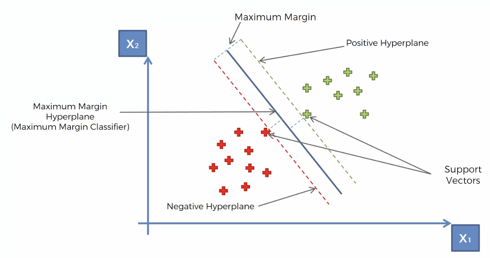
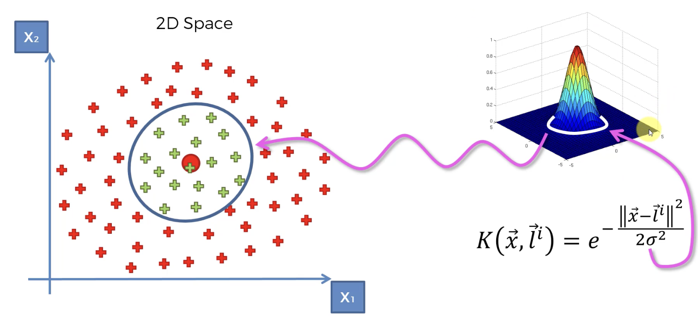
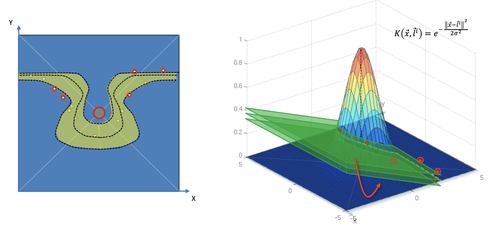

## Classification :
is a ML technique to indentify the category of new observations based on the training data

## Logistic Regression :
- Predicting a categorical variable based on a number of independent variables. The algorithm comes up with a logistic curve or sigmoid curve giving the probablity of being a categorical value
ln p/1-p = b0 + b1X1+......+bnXn
- Maximum likelihood is the parameter to come up with best curve. Likelihood is calculated by multiplying the probabilities of being positive and the probability of being negative (1- positive) for all data points. The curve which gives max value is the best curve.

## K-Nearest Neighbour (KNN)
- Choose the number K of neighbors
- Take the K nearest neighbors of the new data point based on euclidean distance ( d = sqrt((x2-x1)2 + (y2-y1)2))
- Among these K neighbors, count the number of data points in each category
- Assign the new data point to the category where the count of neighbors is maximum

## Support Vector Machine(SVM)

- Optimal Decision Boundary: Unlike other algorithms that can draw many possible lines to separate data, SVM specifically searches for the Maximum Margin Hyperplane. This is the unique boundary that maintains the greatest possible distance (the "margin") between the two classes, ensuring the best possible classification for new data points.

- Support Vectors: The algorithm relies entirely on Support Vectors, which are the data points located closest to the boundary. While most models learn from "average" examples, SVM focuses on these "extreme" or "rebellious" cases (like an orange-colored apple) to define the exact limit where one category ends and the other begins.

## The Kernel trick and the Guassian RBF Kernel
1. The Core Idea: 
The "Mountain" Effect The Gaussian RBF (Radial Basis Function) Kernel acts like a 3D mountain placed on top of a 2D map.The Landmark ($L$): This is the center of the mountain.The Calculation: The formula calculates the distance between a data point ($X$) and that landmark.Close to Landmark: The value is high (close to 1). You are "at the top of the peak."Far from Landmark: The value drops off rapidly toward zero. You are "on the flat ground."
2. Setting the Boundary (Sigma):
 The Sigma ($\sigma$) parameter acts as the "width" of your mountain.High Sigma: Creates a wide, sloping hill that covers many points.Low Sigma: Creates a narrow, steep spire that only covers points very close to the center.By picking the right landmark and sigma, you create a "circle of influence" (circumference). Anything inside that circle is classified as one group (e.g., Green), and anything outside on the flat ground is the other (e.g., Red).
 3. Why is it a "Trick"? 
 Usually, to separate complex data, you would have to do incredibly difficult math to move your data into a higher dimension (like 3D or 10D).The Shortcut: The Kernel Trick allows you to get the benefits of higher dimensions (creating non-linear, circular, or complex boundaries) without actually leaving 2D space.Complex Shapes: You can even add multiple "mountains" (landmarks) together to create custom shapes that surround scattered clusters of data perfectly.
 -The "Aha!" Moment: Instead of drawing a straight line to separate points, you are dropping "cones" over the points you want to select. If a point is "under the cone," it belongs to the target class.
 
 4. Types of kernel functions:
   - Gaussian RBF Kernel
   - Sigmoid Kernel
   - Polynomial Kernel

## Support vector regression (SVR)
1. The Problem: When Lines FailSometimes, data follows a curve or a complex pattern that a straight line (Linear SVR) simply cannot capture. If you try to force a straight line onto curved data, your predictions will be significantly off for most values of $X$. To fix this, we need a model that can "bend."
2. The Solution: Mapping to a Higher DimensionTo handle the curve, SVR uses a mathematical "map" to move the data from a 2D space (where it's hard to separate) into a 3D space (where it becomes easier to model).The RBF Kernel: We apply a function, like the Radial Basis Function (RBF), which acts like a "mountain" or a "cone" placed over our data.Projection: Each 2D data point is projected up onto the surface of this 3D mountain. Points near the center of the mountain are high up (near 1 on the $Z$-axis), while points far away sit near the "floor" (near 0).
3. The "Hyperplane" and the Return to 2DOnce the data is in 3D, the SVR fits a Hyperplane (a flat sheet) through the points.The Intersection: Where this flat 3D sheet cuts through our "RBF mountain" creates a curved line of intersection.The Result: When we project that intersection line back down to our original 2D plot, it appears as a perfectly fitted non-linear trend line that follows the curve of the data.
4. The "Kernel Trick" (Computational Efficiency)While the 3D visualization helps us understand why it works, calculating everything in 3D is very slow.The Shortcut: In reality, SVR uses the Kernel Trick. This allows the algorithm to calculate the relationships between points as if they were in a higher dimension without actually having to build the 3D model.Outcome: You get a sophisticated, non-linear model (including the "epsilon-insensitive tube" that ignores small errors) while keeping the math fast and efficient.Key Takeaway: Non-linear SVR finds a linear solution in a higher-dimensional space and "projects" it back as a curved solution in your original space.

## Bayes Theorem
- Formula : P(A|B) = P(B|A) * p(A) / p(B)
- Illustration:  
  | Fact              | Formula conversion       |
  | :---              | :---                     |
  | Machine1: 30 /hr  |  P(Machine1)=30/50 = 0.6 |
  | Machine2: 20 /hr  |  P(Machine2)=20/50 = 0.4 |
  | Out of all produced parts: 1% are defective | P(Defective)=0.01 |
  | Out of all defective parts:   50% come from machine1 and   50% come from machine2. | P(Machine1\|Defective) = 0.5   P(Machine2\|Defective) = 0.5 |
  | Question: What is the probability that a part produced by machine2 is defective | P(Defective\|Machine2) = ?  |
  | Answer -   P(Defective\|Machine2)  | P(Machine2\|Defective) * P(Defective) / P(Machine2)   = 0.5 * 0.01 / 0.4 = 0.0125. |

## Naive Bayes Classifier
1. The Core ConceptNaïve Bayes is a probabilistic supervised learning algorithm. It classifies a new data point by calculating the probability that it belongs to each possible category based on its "features" (e.g., Age and Salary) and then choosing the category with the highest probability.
2. The Plan of Attack: Bayes' Theorem  
To classify a new point ($X$), we calculate the Posterior Probability for every category. The formula used is: $$P(\text{Class}|X) = \frac{P(X|\text{Class}) \times P(\text{Class})}{P(X)} $$The Four Components: Prior Probability $P(\text{Class})$: The overall likelihood of a category occurring, regardless of features (e.g., $10 \text{ walkers} / 30 \text{ total people}$). Marginal Likelihood $P(X)$: The probability that any new random point will have features similar to our new point. We calculate this by drawing a circle (radius) around the new point and counting all points inside. Likelihood $P(X|\text{Class})$: Among people who already belong to the class (e.g., just the walkers), what is the probability they fall within the circle of similarity? Posterior Probability $P(\text{Class}|X)$: The final result we are looking for—the probability that this specific point belongs to the class given its features.
3. Step-by-Step Execution  Imagine we are deciding if a 25-year-old earning $\$30,000$ Walks or Drives to work.
  - Step 1: Calculate Probability for "Walks"Prior: How many people walk in total?Marginal Likelihood: Draw a circle around the new point. What percentage of the total population is inside that circle?Likelihood: Of the people who walk, how many are inside that circle?Result: Plug these into the formula to get the probability (e.g., $75\%$).- Step 2: Calculate Probability for "Drives"Perform the exact same math, but specifically for the "Drives" category (e.g., $25\%$).
  - Step 3: Compare and Classify Compare the results: $75\%$ (Walks) vs. $25\%$ (Drives).Since $75\% > 25\%$, the algorithm classifies the new point as "Walks."
  4. Key Takeaways for Future Reference The "Radius": The size of the circle you draw around the new point is a parameter you decide. It determines who is considered "similar" to your new observation. Why "Naïve"?: It is called "Naïve" because it assumes that every feature (like Age) is completely independent of every other feature (like Salary), which isn't always true in real life, but the math still works surprisingly well. Scalability: While the example used 2 features (Age, Salary), Naïve Bayes can handle hundreds of features using the same logic.

  ## DecisionTree and RandomForest
  Refer regression.md for the explanation.