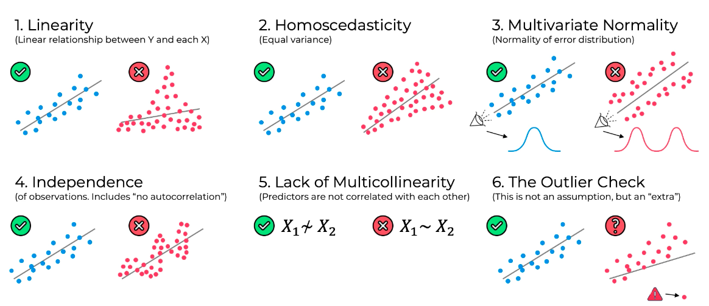
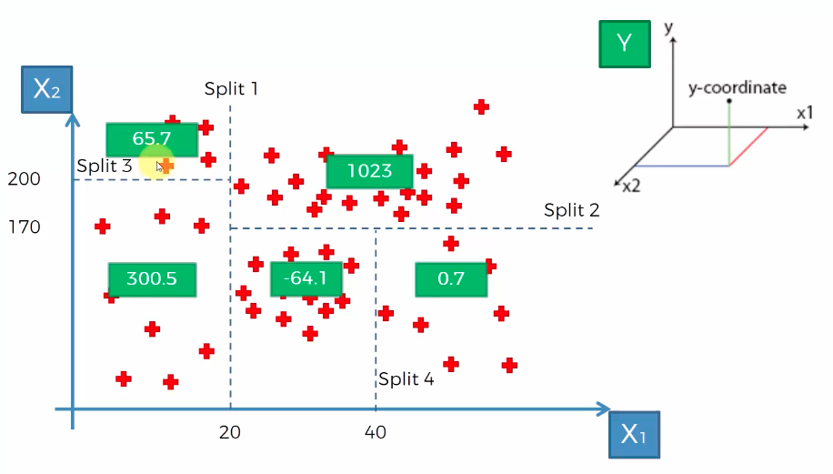
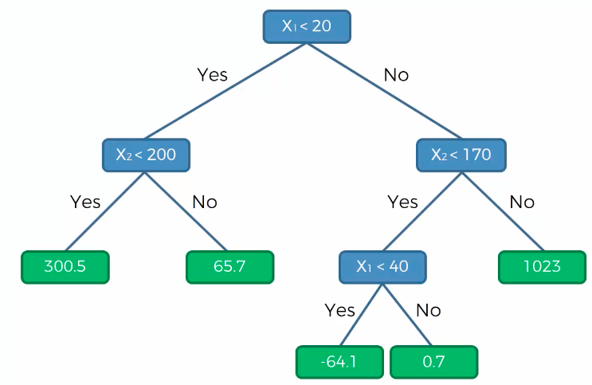

# Simple Linear Regression
No of features/Independent variables - 1 (X1)
No of dependent variables - 1 (y)
Algorithm purpose - How to find the best slope for the training data points
 Method- Following Ordinary least squares method
 yi-> actual data point
 y^i  -> predicted data point for a given combination of independent variable
 residual: yi - y^i
 Formula : y^ = b0 + b1X1 where b0 is y-intercept and b1 is coefficient
 b0, b1 such that: SUM(yi - y^i)2 is minimized

# Assumptions of Linear regression
Linear regression relies on key assumptions to ensure valid, reliable results: a linear relationship between variables, 
homoscedasticity (constant variance of residuals), independence of observations, normality of error distributions, and lack of multicollinearity. 
Violating these can lead to biased or unreliable models, often requiring transformation or alternative techniques.

- Linearity: The dependent variable (y) has a linear relationship with the independent variables (X).
- Homoscedasticity: The variance of the residuals (error terms) is constant across all levels of the independent variables.
- Independence of Errors/Observations: Residuals are independent of each other. Autocorrelation in residuals should be minimal, especially for time-series data.
- Normality of Errors: The error terms (residuals) follow a normal distribution, which is important for producing reliable
-values and confidence intervals.
- No Multicollinearity: Independent variables are not too highly correlated with one another, which can complicate interpreting individual coefficient contributions.
- Zero Conditional Mean: The errors have a conditional mean of zero, meaning the expected value of the error term does not depend on the predictors.
- Exogeneity: The error terms are not correlated with the independent variables (i.e., predictors are independent and observed with minimal error)

# Other concepts
- Handling categorical features - Apply one hot or label encoding depending on how many categories are present
- Dummy variable trap - Always omit one dummy variable per feature
- Null Hypothesis (H0) - The null hypothesis (H₀) states that no relationship exists between the variables being studied — in other words, one variable does not affect the other.
- The alternative hypothesis (H₁ or Hₐ) is the logical opposite.
- A p-value, or probability value, is a number describing how likely it is that your data would have occurred by random chance (i.e., that the null hypothesis is true). The smaller the p-value, the less likely the results occurred by random chance, and the stronger the evidence that you should reject the null hypothesis.
- The p-value in statistics measures how strongly the data contradicts the null hypothesis. A smaller p-value means the results are less consistent with the null and may support the alternative hypothesis. Common cutoffs for statistical significance are 0.05 and 0.01.

# Types of model building
1. <b>All in</b>: Select all variables by default
2. <b>Backward Elimination</b>: Backward elimination is a stepwise feature selection technique used to improve regression models by starting with all potential predictor variables and iteratively removing the least significant one. It aims to simplify models, reduce complexity, and improve performance by eliminating variables with high p-values.  Steps - 
    - Select a significance level to stay in the model (Ex SL -0.05) 
    - Fit the full model with all possible variables 
    - Consider the predictor with highest P value. If P > SL go to step d else Finish 
    - Remove the predictor 
    - Fit model without this variable. Go back to step 3.
3. <b>Forward Selection</b>: is an iterative machine learning and statistical technique that builds a model by starting with no variables and adding the most significant predictor at each step. It continues adding features that most improve model fit (e.g., lowest p-value) until no further significant improvements can be made.  Steps - 
    - Select a significance level to stay in the model (Ex SL -0.05) 
    - Fit all SLR models y ~ Xn. Keep the variable with lowest P value. 
    - Keep this variable and fit all possible models with one extra predictor added to the existing one(s) 
    - Consider the predictor with the lowest p-value. If P < SL, go to Step C, otherwise finish. Keep the previous iteration model.
4. <b>Bidirectional Elimination</b>:Bidirectional elimination, often referred to as stepwise regression, is a hybrid feature selection method that combines forward selection and backward elimination to identify the most relevant independent variables for a predictive model. 
    It works by iteratively adding significant features and removing insignificant ones to optimize the model.
# Multiple Linear Regression
No of features/Independent variables - n (X1.....Xn)
 No of dependent variables - 1 (y)
 Algorithm purpose - How to find the best slope for the training data points
 Formula : y^ = b0 + b1X1 + b2X2 + ..... + bnXn

# Polynomial Linear Regression
No of features/Independent variables - n (X1.....Xn)
 No of dependent variables - 1 (y)
 Algorithm purpose - How to find the best curve for the training data points
 Formula : y^ = b0 + b1X1 + b2X12 + ..... + bnX1n

# Support Vector Regression
Epsilon-Insensitive Tube: SVR fits a tube around the regression line, ignoring errors for data points falling within this boundary, which helps prevent overfitting.
 Support Vectors: Only points outside the epsilon-tube influence the regression function, making the model robust to outliers and noise.
 Key Parameters: The main parameters are the cost (C), which controls the trade-off between error minimization and model flatness, and epsilon (E), which defines the margin width.

# Decision Tree Regression

# Random Forest Regression
Based on ensemble learning (improves machine learning results by combining multiple models (often called "weak learners") to create a single, stronger, and more robust predictive model)
Similar to decision tree but with below steps
- Pick at random K data points from the training set
- Build the decision tree associated with these K data points
- Choose the number N of trees to build and repeat steps 1 and 2
- For a new data point, make each one of the N trees predict the value y and finally return 
  the average of all predicted y values for the given data point.

# Evaluating regression models using R-squared and adjusted R squared
- SSres = SUM(yi - y^i)2
- SStot = SUM(yi - yavg)2
- R2 = 1 - SSres/SStot
- R2 value rules (normally):   1 = perfect (suspicious), ~0.9 = Very good, <0.7 = Not great, <0.4 = Terrible
- Adjusted R2 = 1- ( 1- R2)* n-1/n-k-1 where k - no of independent variables and n - sample size
